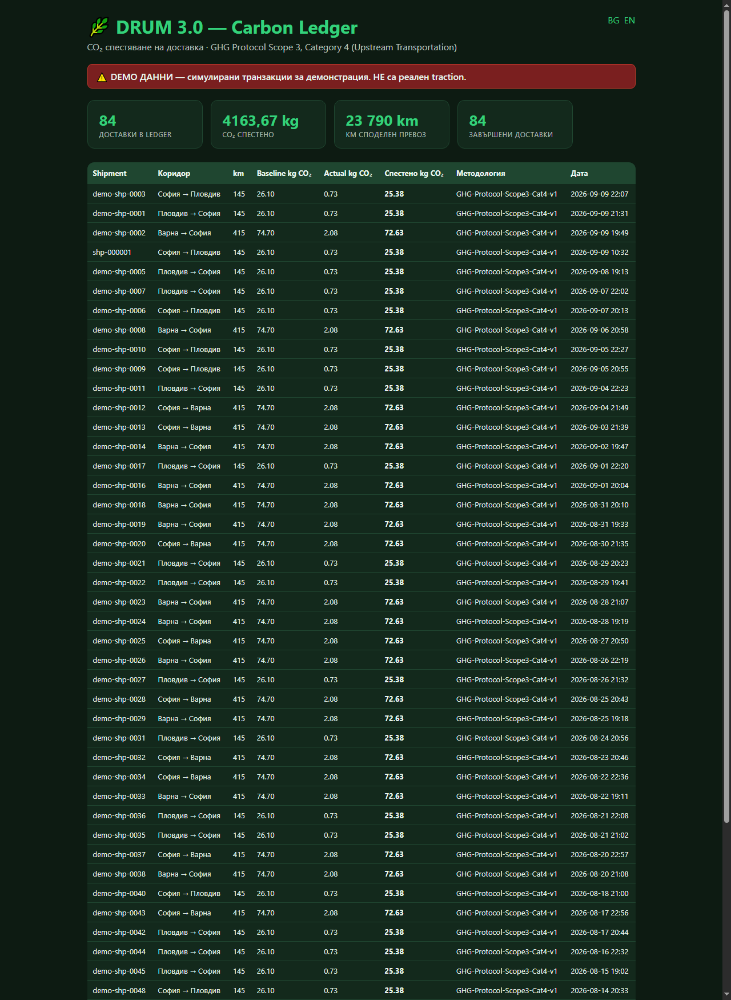
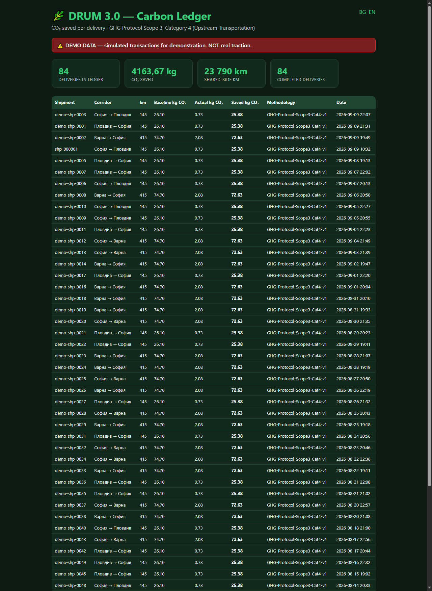
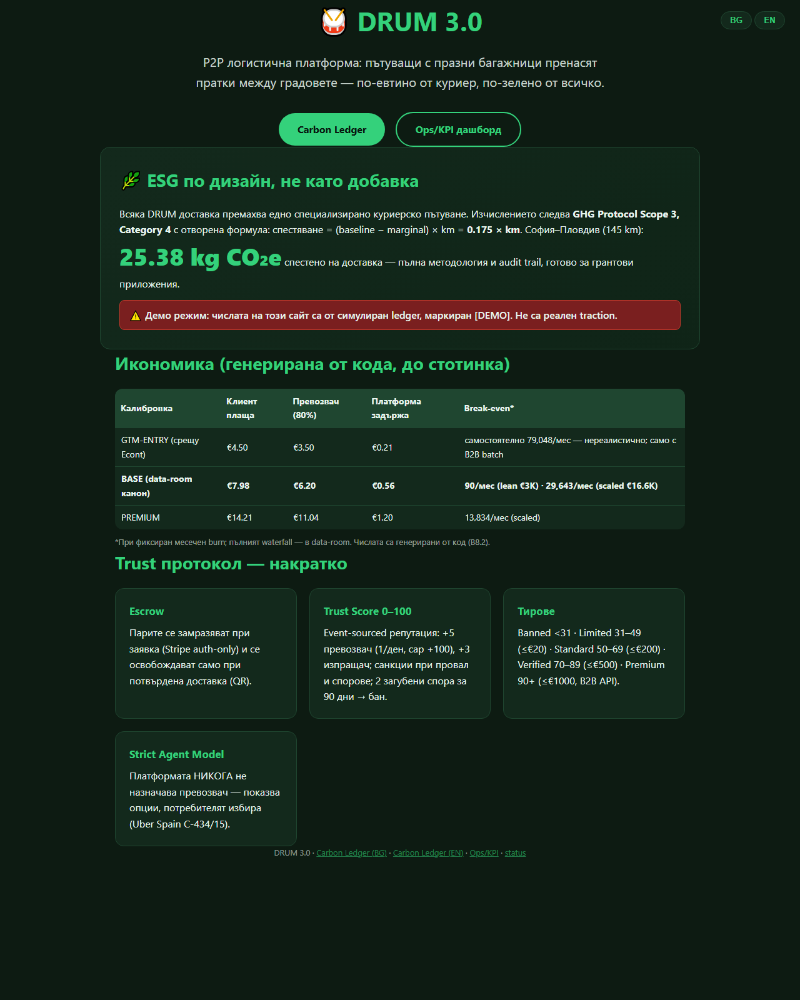
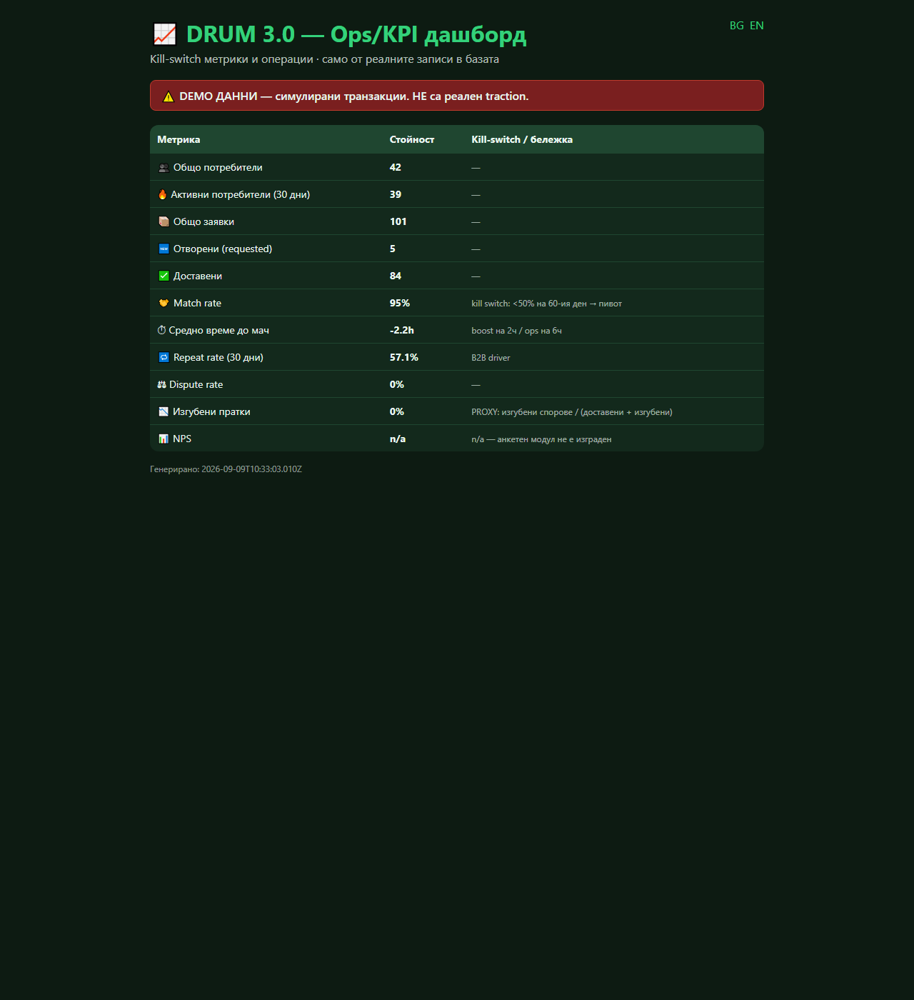

# DRUM 3.0 — Investor Readiness Report v1

| | |
|---|---|
| **Проект** | DRUM 3.0 — P2P логистична платформа (празни багажници ↔ пратки) |
| **Версия** | 0.2.0 (канонично репо: drum-mvp → drum-platform) |
| **Дата на изготвяне** | 2026-09-09 |
| **Git commit** | `9f07722` (pushнат: master → hristovdimitri2-hub/drum-platform) |
| **CI статус** | ✅ **SUCCESS** (GitHub Actions: npm ci → lint → test → coverage gate → demo:e2e → build-financials; run 34340264082, Node 22, ubuntu-latest) |
| **Тестове** | 99/99 pass · lint чист · coverage gate: money 100% / trust 96.8% / carbon 99.2% / matching 100% |
| **Сигурност** | Secret scan на цялата история: CLEAN (16+ commits) · private repo · Dependabot alerts ON · secret scanning: изисква Advanced Security (не е налично — документирано) |
| **Класификация** | За разпространение към потенциални инвеститори. Без ключове, токени, локални пътища или лични данни. |

---

## Executive Summary

**DRUM 3.0** е P2P логистична платформа, координираща свободен транспортен
капацитет — пътуващи с празни багажници пренасят пратки между градовете.
Каноничната инсталация (drum-mvp) е **работещ софтуер**: Telegram бот с
пълен потребителски флоу (заявка → escrow → избор на превозвач → QR
pickup/delivery → автоматично разплащане), Stripe Connect escrow логика
(TEST-only guard), Trust Score система с пълната правилник-таблица от
Бизнес план §2.2, Carbon Ledger с GHG Protocol Scope 3 Cat. 4 методология
и investor-facing дашборди (BG/EN), Ops/KPI дашборд с kill-switch метрики,
B2B batch прототип и data-room с финансов модел, генериран от код.

**Присъда (готовност за инвеститори, едно изречение):** DRUM е инвестицион-
ready като *код и методология* — всичко обещано в демо-то работи, тествано
е (99 теста, CI зелен) и е финансово моделирано с пълна проследимост до
стотинка, но има **нула реални потребители и доставки** — съответно
подходящият ask е валидационен (€31K за 90-дневен пилот), не growth капитал.

---

## Резултат от Пре-етап L (legacy инвентаризация)

Пълната карта: `docs/VERSION_MAP.md`. Резюме:

- Локално + GitHub legacy: **195 попадения** (15 папки, 180 файла).
- „Друм 1–6" са **документни ревизии** (бизнес план/финансов модел/master
  план), НЕ кодови версии — всяка папка съдържа само .lnk преки.
- Единственият код в цялата история: **drum-mvp** (BOT в „Финален проект").
- ГЕЙТ решение (потвърдено от основателя, сценарий А): 3.0 е каноничната
  концепция; legacy материалите са архивирани в `_archive_v1-v6` и
  `_archive_3_0`; уникалните материали (Financial_Model_SYNCED.xlsx,
  Investor Deck, Compendium, Concept_v1) — инвентаризирани и запазени.

## Модули (Етапи 1–4) — какво е построено и как е верифицирано

Легенда: ✅ = РЕАЛНО, тествано · 🟡 = частично · ❌ = не е направено.

### B1 — Данни: adapter интерфейс + SQLite ✅
SQLite (node:sqlite, нулеви deps), 7 таблици + counters, индекси; facade
sqlite/demo/airtable; Postgres път **документиран, не имплементиран** ❌.
Верификация: 6 контрактни теста; чист clone работи без външни услуги.

### B2 — Telegram бот + mock adapter ✅
Пълен флоу: /start → KYC → /new wizard → ops notify → /accept (избор от
потребителя) → /scan pickup/delivery → /status, /list, /matches, /evidence,
/cancel, /help. Mock adapter: целият флоу тестван headless — интеграционен
тест с 8 стъпки. Ограничение: QR „сканиране" = текстов payload (камера →
Telegram WebApp: TODO).

### B3 — Matching v1 ✅ (РАНГВА, не назначава)
Score = 0.4×Trust + 0.3×route + 0.2×history + 0.1×price; ТОП 5;
детерминирани tie-break-ове; escalation 2ч boost / 6ч ops. **Strict Agent
Model**: тест забранява assign/dispatch функции и проверява неизменяемост.
10 теста.

### B4 — Trust Score ✅ (пълната таблица, Бизнес план §2.2)
+5 носач (1/ден, cap +100) · +3 изпращач (1/ден, cap +60) · −15 неуспех ·
−50 загубен спор (+БАН при 2 за 90 дни) · +10 KYC · +5 телефон · +10
реферал (referrer ≥80, макс 5) · −10 изоставен · +2 реципрочен (≥3
доставки) · −5 лош рейтинг · −1/мес неактивност (floor 30) · −25
off-platform. Тирове: <31 banned / 31–49 limited (≤€20, 1/седм) / 50–69
standard (≤€200, 10/мес) / 70–89 verified (≤€500) / 90–100 premium (≤€1000,
B2B API). 26 теста.

### B5 — Stripe + аномалии 1–4 + evidence пакет ✅
Auth-only escrow → capture → split 80/15/5 в стотинки (каноничен money
модул — единствен изчислител); webhook signature verification (тествана);
TEST-only guard. Аномалии: 1 amount mismatch · 2 double-capture + webhook
idempotency · 3 отказан подпис (24ч photo-proof; DEMO photo = placeholder с
метаданни — **реално фото: TODO**, не е мокнато) · 4 chargeback evidence
пакет (едно действие: /evidence или GET /api/evidence/:id; SHA-256,
репродуцируем). 6 + 4 теста.

### B6 — Carbon Ledger v2 ✅
Методология: GHG Protocol Scope 3 Cat. 4; канон **saved = 0.175 × km**
(B6.1 корекция: marginal е абсолютен 0.005 kg/km); audit trail с факторите
във всеки запис; worked example; self-verifying ledger тест; VCS-ready
export (CSV+JSON); дашборд BG/EN. Carrier waiver — TODO бележка ❌.

### B7 — B2B batch прототип ✅
Седмичен batch, caps 5/10, broadcast „гарантиран €X, N пратки", dual mode
±€1.50, batch economics (retained €0.43 vs €0.21 при GTM ×10). Симулация
50 заявки: batch 100% match/~84ч vs on-demand 40%/3ч → B7_SIMULATION.md.
Ограничение: фиктивни параметри (ASSUMPTION етикети) — прототип.

### B8 / B8.1 / B8.2 — Финансов модел ✅
`finance.js` = single source of truth (коридорите в /new идват от там).
Waterfall до €0.00 (floor watermark), ДДС 20% само върху таксата (отгоре),
cross-subsidy 15%+5%, break-even стълбица, 3 сценария, B2B batch economics.
Генератор с независима аритметична проверка. Честни находки: BASE цена при
€16.6K burn НЕ покрива burn-а до Y3 (−€145K/год); GTM-ENTRY валиден само с
B2B batch; carbon приход изключен. Сравнение със SYNCED Excel: 6
разминавания документирани (FINANCIAL_NOTES.md), не подравнени.

### B9 — Ops/KPI дашборд ✅
Kill-switch метрики от реалните записи: match rate, avg time to match,
repeat 30d, dispute rate, lost-parcel (PROXY етикетиран), active users;
NPS = n/a (честно).

### B10 — Landing BG/EN ✅ · B11 — Data room ✅
Landing: ESG + икономическа таблица (B8.2) + Trust протокол + линкове.
Data room: PITCH.md (12 слайда, [[PLACEHOLDER]] екип/traction),
ONE_PAGER.md, RISK_REGISTER.md.

### B12 — ❌ НЕ СЪЩЕСТВУВА в консолидирания бриф (потвърдено);
тестовете са редът „Тестове ≥80%" в Етап 4.

### Legacy — 🟡 архивирано, не активно
Airtable backend (реален, без настроен base); demo-store (legacy); Typeform:
схема на полетата; seed-airtable (ръчни link полета).

---

## Пълен списък на оправените бъгове

| # | Какво е чупило | Как е оправено |
|---|---|---|
| 1 | telegraf/session - премахнат модул в Telegraf 4 -> краш при старт | собствен session middleware в bot.js |
| 2 | express липсваше в package.json | добавен като dependency |
| 3 | /new wizard мъртъв (handleTextInput не беше закачен) | закачен чрез bot.on(text) |
| 4 | Stripe webhook: JSON parser преди raw body -> signature verify винаги fail | webhook route mount-нат ПРЕДИ JSON parser |
| 5 | carrierStripeAccountId не се map-ваше от DB -> payout винаги manual | поле + mapping + запис при /accept |
| 6 | Split: 80% от база x 1.2 != документираното 80/15/5 | каноничен money модул: split на captured, remainder 0.00 |
| 7 | Trust праг <30 вместо <31 | изнесено в trust.js, тест за всички граници |
| 8 | /new без cancel бутон | добавена /cancel команда |
| 9 | start.js: Markup без импорт -> краш на реален /start | импорт добавен; хванат от b2 флоу теста |
| 10 | node:sqlite изисква Node >=22.5, CI беше Node 20 | CI + engines bump на 22 |
| 11 | Carbon формула двусмислена (share vs absolute marginal) | B6.1 канон: saved = 0.175 x km + self-verifying тест |
| 12 | VAT-inclusive (0.34) срещу документиран VAT-on-top (0.414) | канон VAT-on-top; старият път премахнат |
| 13 | Coverage data с Windows backslashes не се match-ваше в gate | нормализация на пътищата |
| 14 | ESLint: 11 unused vars (вкл. axios в qr.js, tx в sqlite.js) | изчистени; lint е CI gate |

## Тестове и качество

- 99 автоматични теста (node --test), всички зелени локално и в CI:
  B1 store 6 - B4 trust 26 - B3 matching 10 - B5 money/anomalies/webhook 20 -
  B6 carbon/export 6 - B7 b2b 7 - B8 finance 15 - B9 kpi 7 - B2 флоу 8.
- Coverage (c8, lines): money 100% / matching 100% / carbon 99.2% /
  trust 96.8% / services общо 88.6% / db 87.2%. Gate >=80% на 4-те
  критични модула - зелен.
- Lint: eslint (flat config), 0 errors - CI gate.
- CI: GitHub Actions, push-trigger; последен run: SUCCESS.

## Скрийншоти









Терминален изход на demo:e2e (пълен текст: reports/demo_e2e_output.txt):

```
-- Стъпка 1: Заявка (BASE) --
  Ticket T: 7.75 = превозвач 6.20 + такса 1.16 + застраховка 0.39
  Клиент плаща: 7.98 (T + ДДС 0.23 върху таксата)
-- Стъпка 2: Escrow --
  PaymentIntent: pi_demo_000001 | статус: requires_capture
-- Стъпка 3: /accept -- ПОТРЕБИТЕЛЯТ ИЗБИРА (Strict Agent Model)
  Статус: matched | Pickup + Delivery QR генерирани
-- Стъпка 4: Pickup scan -- Статус: picked_up
-- Стъпка 5: Delivery scan -> capture + split 80/15/5 --
  Превощач (80%): 6.20 -> transfer tr_demo_000001
  DRUM (15%): 1.16 | Застраховка (5%): 0.39
-- Стъпка 6: Trust Score -- Изпращач 50->53 - Превощач 50->55
-- Стъпка 7: Carbon Ledger --
  Baseline 26.10 - Actual 0.73 = СПЕСТЕНО 25.38 kg CO2e
```

## Финансов модел (BASE калибровка, T = EUR 7.75)

Waterfall на доставка: брутно EUR 7.98 (клиент) - превощач EUR 6.20 (80%) -
DRUM такса EUR 1.16 - ДДС EUR 0.23 (отгоре) - застраховка EUR 0.39 (пул
резерв) - Stripe EUR 0.37 - ПЛАТФОРМА EUR 0.56 (7.2%) - remainder EUR 0.00.

Break-even стълбица (доставки/мес): EUR 50 burn -> 90 - EUR 3,000 -> 5,358 -
EUR 10,000 -> 17,858 - EUR 16,600 -> 29,643.

Сценарии (EBITDA, BASE): при EUR 16.6K/мес burn - Y1 -195,840, Y2 -182,400,
Y3 -145,440 (при 6K/30K/96K доставки годишно). Честен извод: BASE цена не
покрива scaled burn - лостовете са B2B batch (retained 0.43), premium
коридори (1.20), lean burn (3K) или комбинация.

B2B batch economics при GTM (T = 4.37): batch x10 - Stripe 0.93 общо (vs
3.20 on-demand), retained EUR 0.43/пратка = 2.06x. GTM-ENTRY е възможен
САМО с batch. Симулация 50 заявки: batch 100% match/~84ч vs on-demand
40%/3ч (детерминирана, ASSUMPTION етикети).

Пълните таблици: FINANCIAL_MODEL.md / .csv, B7_SIMULATION.md,
FINANCIAL_NOTES.md (6 разминавания със стария Excel, документирани).

## Демо данни (изрично НЕ traction)

- 40 фиктивни потребителя, 106 заявки [DEMO] (83 delivered), 90 carbon
  записа, ~4,138 kg CO2 спестено (симулирано), Trust Events: event-sourced.
- Всеки запис: isDemo true + описания [DEMO]...; дашбордите показват
  червено предупреждение; landing честно заявява демо статуса.
- GDPR: само фиктивни имена/IDs; без телефони; escrow/payments симулирани.

## Остава до production (TODO с приоритети)

- P0: реални Stripe TEST ключове + клиентски checkout (client_secret);
  Connect Express onboarding UI + account.updated webhook.
- P0: Airtable production base (ръчни link полета) или Postgres
  имплементация (документирана в docs/DATABASE.md).
- P1: QR сканиране с камера (Telegram WebApp); structured logging + Redis
  sessions; NPS анкетен модул; ops/support/disputes разходи като явни редове
  във finance.js; реално photo upload (аномалия 3 - сега placeholder).
- P2: Typeform webhook; GPS разстояния + официален емисиен фактор (EEA/DEFRA
  цитиран); carrier waiver формуляр (VCS).
- P3: Postgres имплементация; rate limiting; алгоритъм matching v2 (Year 2+).

## Приложение - локално пускане на демото

```
git clone https://github.com/hristovdimitri2-hub/drum-platform
cd drum-platform
npm install
copy .env.example .env      (Windows; Unix: cp)
npm run seed:demo           # 106 [DEMO] доставки + Carbon Ledger
npm run demo:e2e            # пълна транзакция: escrow -> QR -> capture -> CO2
npm start                   # http://localhost:3000
```

- Landing: / - Carbon Ledger: /dashboard/carbon - Ops/KPI: /dashboard/ops
- Изисквания: Node >=22.5 (node:sqlite). Без външни услуги в DEMO_MODE.
- Повторяемост на PDF: npm install marked -> node scripts/build-report.js ->
  Edge/Chrome headless --print-to-pdf (командата е в README.md).

*Отчетът е полу-автоматичен: числата идват от кода (services/money,
finance, carbon, kpi), скрийншотите са реални headless-заредени страници,
терминалният изход е от действителен прогон. Няма ключове, токени, локални
пътища с потребителски имена или лични данни.*
